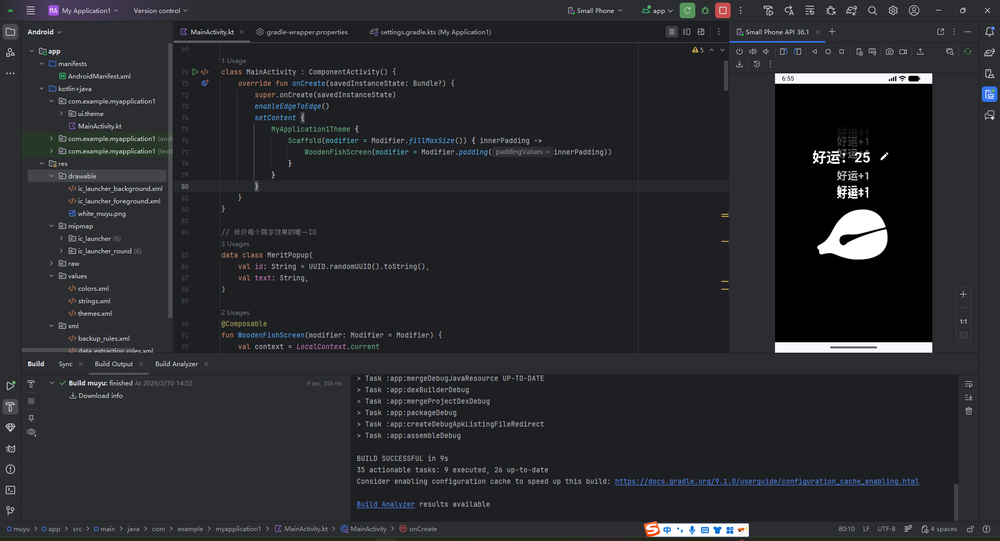
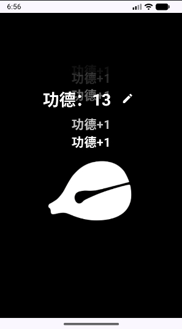

# 木鱼功德机 (`muyuapp`)

一个基于 **Android + Jetpack Compose** 的木鱼应用，支持点击木鱼累积计数、音效反馈、震动反馈和浮动文字动画。

## 功能特性

- 点击木鱼触发：
  - 计数变化（`+1` 或 `-1`）
  - 震动反馈
  - 木鱼音效
  - 浮动文字动画（如 `功德+1`）
- 支持编辑模式：
  - 自定义计数名称（默认 `功德`）
  - 切换每次点击增量（`+1` / `-1`）
  - 保存后重置当前计数
- 使用 `SoundPool` 管理短音效并在界面销毁时释放资源

## 截图

> 以下截图来自项目根目录现有文件：

### 主界面



### 编辑弹窗



## 技术栈

- Kotlin
- Jetpack Compose (Material3)
- Android SDK
- Gradle Kotlin DSL

## 运行环境

- Android Studio (建议最新稳定版)
- JDK 11
- Android `minSdk 30`, `targetSdk 36`, `compileSdk 36`

## 本地运行

```bash
./gradlew assembleDebug
```

Windows:

```powershell
.\gradlew.bat assembleDebug
```

APK 输出路径：

`app/build/intermediates/apk/debug/app-debug.apk`

## 项目结构

```text
muyu/
├─ app/
│  ├─ src/main/java/com/example/myapplication1/MainActivity.kt
│  ├─ src/main/res/drawable/white_muyu.png
│  └─ src/main/res/raw/voice.mp3
├─ ScreenShot_1.png
├─ ScreenShot_2.png
└─ README.md
```

## 说明

- `git_token.txt` 已加入 `.gitignore`，不会被提交到远端仓库.
